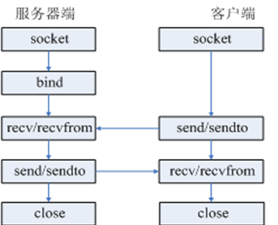

## 17 网络编程

## 一、网络编程

#### 1.网络编程基础

> 计算机网络：把分布在不同区域的计算机通过专门的设备使用通信线路连接起来，从而会形成一个庞大的网络系统，不同的计算机之间就可以进行信息的传递
>
> 网络编程：在同一个网络中不同的机器之间进行通信

#### 2.计算机之间需要通信的条件

> 三要素：ip地址，端口，协议

##### 2.1 ip地址

> - 概念
>
> 		互联网地址（Internet Protocol Address），是联网设备和互联网之间的唯一标识，在同一个网段中，ip地址是唯一的
>
> 		ip地址是数字型的，是一个32位整数，通常将其分为4个8位的二进制，每8位用圆点隔开，并且将8位的二进制转换为0~255之间的十进制，例如：10.0.127.108
>
> - 分类
>
> 		形式分类：
>
> 			ipv4:由4个字节组成，分成4段
>			
> 			ipv6:由6个字节组成，分为6段
>			
> 		功能分类：
>			
> 			A类：保留给政府机构，1.0.0.1~126.255.255.254
>			
> 			B类：分配给中小型企业，128.1.0.1-191.255.255.254 
>			
> 			C类：分配给任何需要的个人，192.0.1.1-223.255.255.254 
>			
> 			D类：用于组播【一种数据传输方式】，224.0.0.1-239.255.255.254 
>			
> 			E类：用于实验，240....~255.....
>			
> 			127.0.0.1   回送地址，一般指的是本机的ip，localhost，一般用于测试
>
> 总结：ip地址可以唯一的确定网络上一个通信实体，但是一个通信实体可以有多个应用程序同时提供网络服务，此时还需要端口

##### 2.2端口

> 1>概念
>
> ​	数据的发送和接收都需要通过端口出入计算机，端口号是唯一标识通信实体上的应用程序
>
> ​	注意：同一台机器上不能两个程序占用同一个端口，端口号：0~65535
>
> 2>分类
>
> ​	a.公认端口：0~1023   
>
> ​	b.注册端口：1025~49151
>
> ​	c.动态端口或者私有端口：1024~65535
>
> 3>常用的端口
>
> ​	mysql:3306
>
> ​	oracle:1521
>
> ​	tomcat:8080
>
> ​	qq:4000

##### 2.3网络协议

> 网络协议：只要连接到网络的设备，相互之间遵循同一种网络协议，才能够进行数据交互
>
> 

#### 3.TCP/IP协议

> 互联网协议，负责两台计算机之间建立可靠的【保证数据安全到达对方】，可连接【面向连接，三次握手】的通信

#### 4.TCP协议

##### 4.1概念

> Transimission Control Protocol ,传输控制协议，基于字节的传输层通信协议
>
> 特点：
>
> ​	a.安全的【确保接收方完全正确的获取发送方发送的全部数据】
>
> ​	b.面向连接的【数据传输必须要建立连接，连接的过程中需要时间】
>
> ​	c.数据传输的效率较低
>
> ​	d.传输的数据的大小有限制，一旦连接建立，双方可以通过指定的格式发送数据
>
> - 面向连接：三次握手
>
> 		a.客户端向服务端发送一个请求
>
> 		b.服务端收到请求之后，回客户端一个响应
>			
> 		c.客户端收到服务端的响应之后，回复给服务端一个确认信息
>
> 
>
> - 四次挥手	
>   - （1） TCP客户端发送一个FIN，用来关闭客户到服务器的数据传送。
>   - （2） 服务器收到这个FIN，它发回一个ACK，确认序号为收到的序号加1。和SYN一样，一个FIN将占用一个序号。
>   - （3） 服务器关闭客户端的连接，发送一个FIN给客户端。
>   - （4） 客户端发回ACK报文确认，并将确认序号设置为收到序号加1。
>
> 
>
> 说明：
>
> ​	使用tcp来实现数据的发送和接收需要发送方和接收方，但是两个通信实体之间没有明确的客户端和服务端之分，在两个通信实体建立连接之前，必须有一个通信实体做出主动姿态，被称为客户端
>
> 

##### 4.2  Socket通信

​	Socket是应用层与TCP/IP协议族通信的中间软件抽象层，它是一组接口。在设计模式中，Socket其实就是一个门面模式，它把复杂的TCP/IP协议族隐藏在Socket接口后面，对用户来说，一组简单的接口就是全部，让Socket去组织数据，以符合指定的协议。Socket:套接字，作用：可以发送和接收数据

> Socket必须知道目标计算机的ip地址，端口号，指定协议类型【TCP】
>
> 
>
> 注意：
>
> a.同一个端口号，如果被一个socket绑定之后，则其他的socket将不能再绑定
>
> b.tcp创建连接的是双向通道，谁先发消息，则默认为是客户端，另外一方位服务端

#### 5.UDP协议

> User Datagram Protocol,用户数据包协议，提供面向无连接的不可靠的信息传输服务
>
> 特点：
>
> ​	a.不安全【发送方只负责将信息发送出去，数据能不能到达对方，或者到达对方的信息是否正确，都不做任何保证】
>
> ​	b.无连接的【进行信息发送之前，无需进行发送方和接收方之间的连接】
>
> ​	c.速度快
>
> ​	d.大小是有限制的，每个数据包的大小必须限制在64k以内
>
> 

## 二、高阶函数

如果一个函数的参数是另外一个函数，那么这个函数就可以称为高阶函数

## 2.1 map

map是系统内置函数，map函数接收两个参数，一个是函数，一个是可迭代对象(Iterable)，map将传入的函数依次作用到序列的每个元素，并把结果作为新的Iterator返回。

~~~
"""
map(function,iterable)
参数1：function，函数,函数的参数个数取决于后面序列的个数
参数2：iterable，一个序列或多个序列

功能：将传入的函数依次作用于序列中的每一个元素，并把结果作为新的Iterator返回
"""
#1.传入函数一个参数
def fun(x):
    return  x ** 2

#需求：获取一个列表中每个元素的平方，生成一个新的列表
l1 = map(fun,[1,2,3,4])
print(l1)   #<map object at 0x000001E86D3DA6D8> #返回的是迭代器
print(list(l1))  #[1, 4, 9, 16]  #将迭代器转换为迭代对象

#传入函数2个参数
l1 = [1,2,3,4]
l2 = [2,3,4,5,6,7]
def mul(x, y):
    return x * y
#注意如果两个列表长度不一样，以短的为主计算，函数是平行取值，也就是说x取l1的值，y取l2的值
gen1 = map(mul,l1,l2)  #可以使用lambda表达式
print(list(gen1))  #[2, 6, 12, 20]

#提取字典的键
gen3 = map(lambda x:int(x),{'1':10,'2':20})
print(list(gen3)) #[1,2]

#元组
gen4 = map(lambda x,y:(x,y),[1,2,3,4,5],[1,2,3])
print(list(gen4))  #[(1, 1), (2, 2), (3, 3)]
~~~

## 2.2 reduce

reduce()函数也是functools模块中的一个高阶函数。需要引入functools模块才能使用。

~~~
'''
functools.reduce(f, iterable[, initializer])
参数1：函数，这个函数需要两个参数。
参数2：可迭代对象
参数3：可选，是默认值
返回值：f函数计算的结果
'''
from functools import reduce
#1.累加求和
def add(x,y)
    return x + y
print(reduce(f,[1,2,3,4,5],5))
计算过程：
 （1）a = f(1,2)  #将1赋值给x，2赋值给y
 （2）a = f(a,3)  #a赋值给x，3赋值给y
 （3）a = f(a,4)
  (4）a = f(a,5)
  (5）f(d,10) = 20

#将序列变成整数
print(reduce(lambda x,y:x*10+y,[9,0,7,8])) #9078
~~~

## 2.3 filter

filter是内建函数，可以对可迭代对象进行过滤，去除不满足条件的元素

~~~
filter(function, iterable) 
参数： function 确定是否保留元素，为真保留，为假去除元素,function的值可以None
       iterable 可迭代对象
返回值：一个新的迭代器或迭代对象
#1 过滤掉非字符串数据
print(filter(lambda x:isinstance(x,str),['1',8,'2',3,True,0.9])) 
等价于:
  [s for s in ['1',8,'2',3,True,0.9] if isinstance(s,str)]
  
#2 回文数
#回文数判断
def is_palindrome(n):
    l1 = list(str(n))  #将数字转换为字符串，再将字符串转为列表
    l2 = l1[::-1] #获取反向列表
    if l1 == l2:  #列表比较,长度相同，每一个元素都相同则为真
        return True
    return False

#找出1-1000内所有的回文数
print(list(filter(is_palindrome,range(1,1001))))
~~~

## 2.4 sorted

sorted是内建函数，用于对有序序列进行排序，生成一个新序列

~~~
sorted(iterable[, key=None][, reverse=False]) 
参数：iterable  排序对象，可以列表、元组、字符串等有序序列
      key 一个函数，作用于序列的每一个元素，根据函数返回值进行排序，
           具体的函数的参数就是取自于可迭代对象中，
      reverse 默认从小到大排序，如果reverse为True则从大到小排序
返回值： 新的序列
#字符串排序
print(sorted(['bob', 'about', 'Zoo', 'Credit'], key=str.lower)) #指定把元素变为小写后再排序

#多维数据排序
l=[('a', 1), ('b', 2), ('c', 6), ('d', 4), ('e', 3)]
print(sorted(l,key=lambda x:x[1]))  #使用元组的第二个元素排序

students = [{'name':'abc','gender':'男','age':23} ,
            {'name': 'kkd', 'gender': '男', 'age': 19} ,
            {'name': 'ccxsbc', 'gender': '男', 'age': 20}]
print(sorted(students,key=lambda elem:elem['age']))  #指定用age排序
~~~

