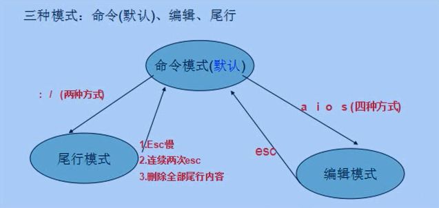
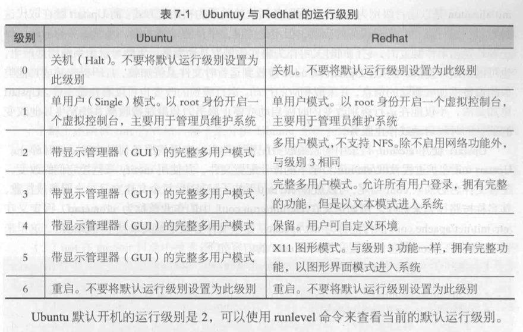

# linux常见服务

## 一. 文本编辑器

常见的文本编辑器有gedit、vi、vim、sublime

vim是vi增强版，号称编辑器之神

vim需要安装

~~~
sudo apt-get -y install vim
~~~

vim的三种工作模式

 


1 编辑模式

命令模式=>编辑模式iaos

| 按键 | 作用                               |
| ---- | ---------------------------------- |
| I    | 行首插入                           |
| i    | 在光标位置前插入文本               |
| a    | 光标后面的位置插入文本             |
| A    | 当前行的行尾插入文本               |
| S    | 删除当前行内容，重新输入           |
| s    | 删除光标当前位置的字符，开始输入   |
| o    | 在当前的下一行开始一个新行开始输入 |

2 命令模式

编辑模式=>命令模式   请按esc

| 按键      | 作用                    |
| --------- | ----------------------- |
| H         | 向左移动一个字符        |
| j         | 向下移动一行            |
| k         | 向上移动一行            |
| l(L)      | 向右移动一个字符        |
| (         | 移动到块首              |
| )         | 移动到块尾              |
| gg        | 移动第一行              |
| G         | 移动尾行                |
| ngg       | 移动到第n行 n是一个数字 |
| yy        | 复制光标当前行          |
| nyy       | 复制n行                 |
| p         | 黏贴                    |
| np  100p  | 黏贴n次                 |
| dd        | 删除一行                |
| ndd       | 删除n行                 |
| u         | 撤销上一次的操作        |
| shift + 6 | 移动到本行行首          |
| shift+ 4  | 移动到本行行尾          |
| ctrl + r  | 恢复前一个被撤销的操作  |
| .         | 重复前一个操作          |

3 底行模式

命令模式=》底行模式   按  : 或者  / ？

| 按键                       | 作用                                       |
| ------------------------ | ---------------------------------------- |
| :w                       | 保存，不退出                                   |
| :q                       | 不保存，退出                                   |
| :q!                      | 强制退出，不保存                                 |
| :wq                      | 保存并退出                                    |
| :x                       | 保存并退出                                    |
| :set nu                  | 显示行号                                     |
| :set nonu                | 不显示行号                                    |
| :n                       | 移动到指定的行                                  |
| /字符串  （回车）               | 搜索指定字符串  n找下一个，N找上一个                     |
| ?字符串                     | 从下往上找，n往上找，N往下找                          |
| :s/要找的字符串/要替换的字符串        | 替换光标当前行的找到的第一个字符串                        |
| :s/要找的字符串/要替换的字符串/g      | 替换光标当前行的找到的所有字符串                         |
| :%s/要找的字符串/要替换的字符串       | 替换每一行第一个找到字符串                            |
| :%s/要找的字符串/要替换的字符串/g     | 全文替换                                     |
| :n1,n2s/要找的字符串/要替换的字符串/g | n1与n2为数字，在第n1与n2行之间查找指定字符串，并将该字符串替换为要替换的字符串 |

## 二. 网络管理

1. ifconfig  

    配置和显示Linux内核中网络接口的网络参数。

    ~~~
    #1 显示网络信息
    [root@localhost ~]# ifconfig
    ens33      Link encap:Ethernet  HWaddr 00:1C:42:14:7A:DD  
              inet addr:192.168.3.46  Bcast:192.168.3.255  Mask:255.255.255.0
              inet6 addr: fe80::21c:42ff:fe14:7add/64 Scope:Link
              UP BROADCAST RUNNING MULTICAST  MTU:1500  Metric:1
              RX packets:351142 errors:0 dropped:0 overruns:0 frame:0
              TX packets:748 errors:0 dropped:0 overruns:0 carrier:0
              collisions:0 txqueuelen:1000 
              RX bytes:81649700 (77.8 MiB)  TX bytes:94340 (92.1 KiB)
    
    lo        Link encap:Local Loopback  
              inet addr:127.0.0.1  Mask:255.0.0.0
              inet6 addr: ::1/128 Scope:Host
              UP LOOPBACK RUNNING  MTU:65536  Metric:1
              RX packets:0 errors:0 dropped:0 overruns:0 frame:0
              TX packets:0 errors:0 dropped:0 overruns:0 carrier:0
              collisions:0 txqueuelen:0 
              RX bytes:0 (0.0 b)  TX bytes:0 (0.0 b)
    重要数据说明：
        inet addr: ipv4地址    inet6: ipv6地址
        HWaddr:  mac地址     Mask: 子网掩码
        UP：代表网卡开启   RUNNING：代表网卡的网线被接上   MULTICAST：支持组播 MTU：最大传输单元 （1500字节）。
        
    #2. ifconfig ens33 查看指定网卡信息
    #3.启动关闭网卡
    ifconfig ens33 up  #启动网卡
    ifconfig ens33 down   #关闭网卡
    
    #4 重启网络
    /etc/init.d/networking restart
    ~~~

2. ping

    ping命令用来测试主机之间网络的连通性

    ~~~shell
    用法:  ping [参数] [主机名或IP地址]
    参数：
        -c n     执行指定次数 n的ping命令
        -b       测试与网关IP的连通性
    #1.查看于百度的联通型
    [root@localhost ~]# ping -c 3 www.baidu.com
    
    #2.查看于网关的连通性
    [root@localhost ~]# ping -b www.baidu.com
    
    ~~~

3. netstat  查看网络连接状况

    ~~~shell
    netstat  -an
      -n  显示端口
      -p  显示进程
      -t tcp
      -u udp
      -a  显示所有
    #1.sudo netstat -nt　　　　　　 显示所有已建立的TCP连接
    Active Internet connections (w/o servers)
    Proto Recv-Q Send-Q Local Address               Foreign Address             State     
    tcp        0      0 10.0.112.235:22             10.0.112.252:57530          ESTABLISHED 
    tcp        0     64 192.168.3.46:22             192.168.3.50:58677          ESTABLISHED 
    
    #2. sudo netstat  -nu　　　　　　显示已建立的UDP连接
    #3. sudo netstat -ntpa　　　　　显示TCP端口号的使用情况
    ~~~


## 三. 进程管理

1. ps

    Linux中的ps命令是Process Status的缩写。ps命令用于报告当前系统的进程状态。可以搭配kill指令随时中断、删除不必要的程序。

        用法:  ps  [选项参数]  [用户名]（可选）
          参数：
           -a -e 显示所有进程
           -u  显示进程的详细信息
           -x ：通常与 a 这个参数一起使用，可列出较完整信息。
           -r：正在运行的进程
        #1.ps -e|more -20　　　　  显示所有进程，每屏20个
        #2.ps -u root|more -10　  显示指定用户的进程信息
        #3. ps -ef|grep kworker   过滤指定信息
        #4. ps -aux| grep ssh 列出目前所有的正在内存当中的程序
        USER       PID %CPU %MEM    VSZ   RSS TTY      STAT START   TIME COMMAND
        root         1  0.0  0.1  19232  1496 ?        Ss   00:23   0:00 /sbin/init
        root         2  0.0  0.0      0     0 ?        S    00:23   0:00 [kthreadd]
        root         3  0.0  0.0      0     0 ?        S    00:23   0:00 [migration/0]
        PID 进程号   %CPU  cpu的占用率   %MEM  内存的占用率  VSZ 占用虚拟内存的量  RSS 驻留内存的量
        TTY 进程的控制终端，？表示不是从终端进入的。   STAT 进程状态(R就绪 S可中断的休眠态 T暂停执行)
        START 进程开始时间  TIME已经执行的时间
        
        #杀死进程
        kill [参数] 进程号
        #1. kill 2 杀死指定进程号的进程
        #2. kill -9 2 强制杀死指定进程号的进程
        
        #杀死指定进程名的进程
        killall -TERM  进程名称

2. top

    top命令是Linux下常用的性能分析工具，能够实时显示系统中各个进程的资源占用状况，类似于Windows的任务管理器。

    ~~~
    用法： top
    使用q退出
    top - 03:32:26 up  3:08,  2 users,  load average: 0.03, 0.04, 0.05
    Tasks: 100 total,   1 running,  99 sleeping,   0 stopped,   0 zombie
    Cpu(s):  0.0%us,  0.0%sy,  0.0%ni,100.0%id,  0.0%wa,  0.0%hi,  0.0%si,  0.0%st
    Mem:   1016160k total,   163660k used,   852500k free,     9412k buffers
    Swap:  2064380k total,        0k used,  2064380k free,    51072k cached
    
      PID USER      PR  NI  VIRT  RES  SHR S %CPU %MEM    TIME+  COMMAND                   
        1 root      20   0 19232 1496 1224 S  0.0  0.1   0:00.95 init                     
        2 root      20   0     0    0    0 S  0.0  0.0   0:00.03 kthreadd                 
        3 root      RT   0     0    0    0 S  0.0  0.0   0:00.05 migration/0               数据说明：
    03:32:26    当前时间
    up 3:08    系统运行时间，格式为时:分
    2 user    当前登录用户数
    load average: 0.03, 0.04 0.05    系统负载，即任务队列的平均长度。三个数值分别为 1分钟、5分钟、15分钟前到现在的平均值。
    
    第二、三行为进程和CPU的信息。当有多个CPU时，这些内容可能会超过两行。内容如下：
    total 进程总数         running 正在运行的进程数       sleeping 睡眠的进程数
    stopped 停止的进程数   zombie 僵尸进程数              Cpu(s): 
    
    最后两行为内存信息。内容如下：
    Mem:
    191272k total 物理内存总量      173656k used 使用的物理内存总量    17616k free    空闲内存总量
    22052k buffers    用作内核缓存的内存量   
    Swap: 
    192772k total    交换区总量      0k used    使用的交换区总量    192772k free    空闲交换区总量
    
    进程信息区统计信息区域的下方显示了各个进程的详细信息。首先来认识一下各列的含义。
    序号  列名    含义
    a    PID     进程id
    b    PPID    父进程id
    c    RUSER   Real user name
    d    UID     进程所有者的用户id
    e    USER    进程所有者的用户名
    f    GROUP   进程所有者的组名
    g    TTY     启动进程的终端名。不是从终端启动的进程则显示为 ?
    h    PR      优先级
    ~~~


## 四. 磁盘管理

- 硬盘类型： HDD 机械硬盘、SDD 固态硬盘  HHD混合硬盘

- 文件系统
  - windows:  fat16  fat32  exFat ntfs
  - linux:    ext2  ext3  ext4

- 查看磁盘使用情况 df

      df -h /dev/sda1  #查看第一个硬盘的使用情况
      	第一块硬盘是 : sda
          第二块硬盘是 : sdb
          第三块硬盘是 : sdc
          df  -h  以用户最佳体验查看
          df  -k    以k为单位
          df  -m    以兆为单位

- du 查看文件或目录的空间使用情况
  - -a  显示目录大小，包括其子目录和文件大小

  - -s 显示目录大小，不显示其子目录和文件大小

  - -c 显示目录及其文件大小，并统计总的大小

      ~~~
      user1@ubuntu:~/tmp$ du -h ~/tmp
      8.0K    /home/user1/tmp
      
      显示家目录大小
      du -s ~
      
      显示文件大小
      du -h 1.txt
      ~~~

- 磁盘分区 fdisk

       fdisk -l #查看磁盘分区情况
       fdisk [option] 设备
              -m  帮助
              -n  创建一个新分区
              -d   删除一个分区
              -w   保存
              -q   不保存
   
      1 创建一个新的分
   ​        e   extended  扩展分区
   ​        p   primary partition (1-4) 主分区
   ​       必须先创建一个主分区，n -> p ->    -> 自己定义大小 ->w(保存)
      2 格式化
   ​     mke2fs -t ext4  /dev/sdb1    #-t 文件系统类型   mkfs
      3 挂载 mount
   ​      所谓挂载就是把硬盘和目录绑定，通过指定的目录进入硬盘
   ​      #临时挂载
   ​      mount -t ext4 /dev/sdb1 /csl/diskb #将sdb1挂载到/csl/diskb目录
   ​      
   ​      永久挂载：
   ​      vim /etc/fstab
   ​       /dev/sdb1              /csl/diskb               ext4    defaults        0 0
   ​       要挂在的磁盘             挂载点                   文件类型   挂载参数      是否需要备份   是否开机检查磁盘（0不检查，1检查）
   ​      立即生效  mount -a
   ​      
         取消挂载
           umount /csl/diskb  

## 五. 其它

1. uname

   uname命令用于显示系统信息

   ~~~
   #显示linux核心版本号
   uname -r 
   
   #显示系统所有信息
   uname -a
   
   #显示操作系统版本
   uname -v
   ~~~

2. hostname

   显示或设置主机名称

   ~~~
   #显示主机名
   $ hostname
   
   #临时设置主机名
   $ sudo hostname hello
   
   #永久设置主机名
   $ vim /etc/hostname #ubuntu的主机名在/etc/hostname文件中，其他liux可能会在/etc/sysconfig/network中
   ~~~

3. who 

   显示当前登录用户

   ~~~shell
   who  -a 显示所有信息
   $ who -a
              系统引导 2018-03-30 14:17
   登录     tty1         2018-03-30 14:17               952 id=tty1
              运行级别 5 2018-03-30 14:17
   python   + tty7         2018-03-30 14:17 02:34        1431 (:0)
   ~~~

4. w

   用来查看登录者的信息及他们的行为

   ~~~shell
   w 命令：执行这项指令可得知目前登入系统的用户有那些人，以及他们正在执行的程序。单独执行w 命令会显示所有的用户，您也可指定用户名称，仅显示某位用户的相关信息。
   
   语法：w [-fhlsuV][用户名称]
   linux w 命令参数：
       -f 　开启或关闭显示用户从何处登入系统。
       -h 　不显示各栏位的标题信息列。
       -l 　使用详细格式列表，此为预设值。
       -s 　使用简洁格式列表，不显示用户登入时间，终端机阶段作业和程序所耗费的CPU时间。
       -u 　忽略执行程序的名称，以及该程序耗费CPU时间的信息。
   
   #1. 常见用法，直接使用
   [root@localhost csl]# w
    03:44:07 up  3:20,  2 users,  load average: 0.07, 0.08, 0.06
   USER     TTY      FROM              LOGIN@   IDLE   JCPU   PCPU WHAT
   root     tty1     -                01:41    1:00m  0.13s  0.13s -bash
   root     pts/1    192.168.3.50     02:34    0.00s  0.18s  0.00s w
   ~~~

5. last

   显示用户最近登录信息

   ~~~shell
   #显示用户最近登录信息，只显示10行
   $ last -10  
   python   tty7         :0               Fri Mar 30 14:17    gone - no logout
   reboot   system boot  4.13.0-37-generi Fri Mar 30 14:17   still running
   python   tty7         :0               Thu Mar 29 20:59 - down   (17:17)
   reboot   system boot  4.13.0-37-generi Thu Mar 29 20:49 - 14:17  (17:28)
   python   pts/18       10.0.103.229     Thu Mar 29 14:53 - 18:00  (03:07)
   python   pts/17       10.0.136.238     Thu Mar 29 09:48 - 17:05  (07:17)
   python   pts/17       10.0.136.238     Thu Mar 29 09:36 - 09:48  (00:11)
   python   tty7         :0               Thu Mar 29 09:36 - down   (08:24)
   reboot   system boot  4.13.0-37-generi Thu Mar 29 09:36 - 18:00  (08:24)
   python   pts/18       10.0.136.238     Thu Mar 29 09:17 - 09:35  (00:17)
   ~~~

6. 内存查看

   ~~~
   # 查看内存
   root@ubuntu:/home/python# free  -h
                 total        used        free      shared  buff/cache   available
   Mem:           3.3G        1.5G        1.5G         10M        388M        1.6G
   Swap:          1.0G          0B        1.0G
   
   # 释放内存
   sudo sh -c 'echo 1 > /proc/sys/vm/drop_caches'
   sudo sh -c 'echo 2 > /proc/sys/vm/drop_caches'
   sudo sh -c 'echo 3 > /proc/sys/vm/drop_caches'
   ~~~


## 六. linux的启动

1 开机BIOS加载

2 读取MBR引导记录

3 加载linux内核

4 加载init进程，实现系统初始化，init进程是其他所有进程的父进程



5 执行/etc/init/rc-sysinit.conf，设置启动级别

~~~
0-关机模式，
1-单用户模式，单用户只有系统管理员可以登录。
2-多用户模式，但是不支持文件共享，例如不支持NFS服务.这种模式不常用。
3-完全的多用户模式，支持NFS服务.最常用的用户模式，默认登录到系统的字符界面。
4-保留模式。
5-完全多用户模式，默认登录到X-window系统，也就是登录到linux图形界面。
6-重启模式，也就是执行关闭所有运行的进程，然后重新启动系统
~~~

6 启动内核

7 执行不同运行级别脚本程序，视级别的不同执行rc0~rc6下的脚本来完成相应的初始化和启动工作

8 执行/etc/init.d/rc.local ，可以把要自动加载的程序写到这个脚本里

9 用户登录

~~~
显示当前运行模式的命令：
runlevel
who -r
~~~


## 七.  计划任务

### 7.1 周期性定时任务

在指定的时间做指定的事情，周期性的事情。需要用户有相应的权限，否则无法操作

vim /etc/crontab 打开定时任务  

当前登录用户可以使用：

crontab -l 查看定时任务   /etc/crontab 里边的除外

crontab -e 编辑定时任务

分                  小时              日                  月                 周          操作                    解释

0-59             0-23            1-31                1-12              0-6

0                    0                   *                     *                  *          mysqldum          每天0时备份数据库

0                     2                  *                    *                   0         sync                       每个星期天2点中做文件同步

0                    0                   15                 *                    *        /usr/local/jsgz.py       每个月的15号0时计算工资

0                    */1                *                   *                    *           sh                                       每个1个小时执行脚本

0                  8,12,18           *                  *                     *          daka.py             每天的8点、12点、18点打卡

0                   8-22               *                  *                      *         study.py           每天8-22在教室学习   

crontab  -r  清空所有定时任务  只能清除crontab  -e产生的定时任务

清除指定定时任务  crontab -e   删除指定行

service cron  start/restart/stop  #启动、重启、停止定时任务

-   实时查看日志

```shell
tail -f  cat 文件名
watch -d -n 秒数  cat /8.txt #带高亮
```

### 7.2 at一次性定时任务

at 命令是用来执行一次性任务，比如要在二十分钟后重启，要在 2 分钟后启动一个可执行程序，或者在一天后执行一个脚本。适合应对突发性和临时性的任务。

~~~
#1 安装at服务
sudo apt-get install at
#查看服务是否运行
service atd status
#重启服务
service atd restart |start | stop

#at命令说明：
[root@www /]# at [-ldc]  用于查看、取消、显示任务的详情
-l：列出当前用户的at任务列表，也可使用 atq
-d 任务编号：取消一个at 任务，后面跟 at 任务编号，也可使用atrm 任务编号代替
-c 任务编号：显示该任务的实际内存，如：at -c 1 ,显示 1 号任务的详情

[root@www /]# at 时间    设置定时任务
at 时间有多种指定方式：

HH:MM 如： at 02:30
HH:MM YYYY-MM-DD 如：at 8:00 2020-01-01
HH:MM[am | pm] [month] [date] 如：at 8:00 Oct 1 # 在十月一号的八点 
HHlMM[am | pm] + number [minutes | hours | days | weeks] 如：at 8:00 + 1days
最常用的的一个时间：now + 时间 比如在十分钟后：at now + 10 minutes，在一天后：at now + 1 days

#使用示例：
python@ubuntu:~$ at now + 3 minutes
warning: commands will be executed using /bin/sh
at> ls -l
at> <EOT>   #按ctl+d自动产生<EOT>
job 4 at Tue Jun 12 22:56:00 2018

#查看任务列表
python@ubuntu:~$ at -l
4	Tue Jun 12 22:56:00 2018 a python
~~~


## 八. 软件安装

### 8.1 压缩与解压

windows常见的压缩包:rar zip  7zip iso

linux常见的压缩包:  zip  gz  bz2   tar

1. gz压缩和解压
   ~~~
   如果没有gzip,用apt安装

   # apt-get  install gzip

   gzip 文件名1  文件名2 #多文件压缩，自动生成对应压缩包  文件名.gz  不能压缩目录  删除原件
   gzip -d 压缩包1  压缩包2   #支持批量解压，删除原件
   ~~~

2. bz2压缩和解压

   ~~~
   压缩
   bzip2 文件名1  文件名2   #支持批量压缩 不支持压缩目录 自动升成 文件名.bz2

   解压
   bzip2 -d 包名1  包名2   #自动删掉原件
   ~~~

3. tar压缩和解压(*)

   ~~~
   tar [option]
      -c 打包
      -x 解包
      -v 可视化
      -f指定文件名
      -t 查看包里的东西
      -z 用gzip对包进行压缩
      -j 用把bzip2对包进行压缩

      tar -cvf 包名   文件名1 文件名2  目录1  #不删除原件，可以打包目录
      tar -xvf 包名   #不删除原件

      打包并压缩
      tar -zcvf 包名  文件名1 文件名2  目录1 
      tar -jcvf 包名  文件名1 文件名2  目录1

      解压
      tar -zxvf  包名     gz xz
      tar -jxvf  包名
   ~~~

4. zip压缩和解压

   ~~~
   apt-get -y install zip unzip

   zip 包名  文件名或目录
   unzip 包名
   ~~~

   ​

### 8.2 软件的安装

1. apt

解决deb复杂的依赖关系

~~~
查看软件包信息 		  sudo apt-cache showsrc 包名
获得源码       		     sudo apt-get source 包名
安装软件     		     sudo apt-get install 包名  -y
删除软件                  sudo apt-get remove 包名
获取新的软件包列表         sudo apt-get update
升级有可用更新的软件包     sudo apt-get upgrade
~~~

- 手动更新软件源

~~~shell
# 1.备份文件
sudo cp /etc/apt/sources.list  /etc/apt/sources.list.old
# 2.编辑文件
sudo gedit /etc/apt/sources.list
#删除文件内容，然后把下面内容拷贝进去
# deb cdrom:[Ubuntu 16.04 LTS _Xenial Xerus_ - Release amd64 (20160420.1)]/ xenial main restricted
deb-src http://archive.ubuntu.com/ubuntu xenial main restricted #Added by software-properties
deb http://mirrors.aliyun.com/ubuntu/ xenial main restricted
deb-src http://mirrors.aliyun.com/ubuntu/ xenial main restricted multiverse universe #Added by software-properties
deb http://mirrors.aliyun.com/ubuntu/ xenial-updates main restricted
deb-src http://mirrors.aliyun.com/ubuntu/ xenial-updates main restricted multiverse universe #Added by software-properties
deb http://mirrors.aliyun.com/ubuntu/ xenial universe
deb http://mirrors.aliyun.com/ubuntu/ xenial-updates universe
deb http://mirrors.aliyun.com/ubuntu/ xenial multiverse
deb http://mirrors.aliyun.com/ubuntu/ xenial-updates multiverse
deb http://mirrors.aliyun.com/ubuntu/ xenial-backports main restricted universe multiverse
deb-src http://mirrors.aliyun.com/ubuntu/ xenial-backports main restricted universe multiverse #Added by software-properties
deb http://archive.canonical.com/ubuntu xenial partner
deb-src http://archive.canonical.com/ubuntu xenial partner
deb http://mirrors.aliyun.com/ubuntu/ xenial-security main restricted
deb-src http://mirrors.aliyun.com/ubuntu/ xenial-security main restricted multiverse universe #Added by software-properties
deb http://mirrors.aliyun.com/ubuntu/ xenial-security universe
deb http://mirrors.aliyun.com/ubuntu/ xenial-security multiverse

# 3.保存退出后，执行命令
sudo apt-get update
sudo apt-get upgrade
~~~

~~~shell
安装nginx
#1 更新软件列表
sudo apt-get update

#2 安装
sudo apt-get install nginx

#3 启动服务
sudo  /etc/init.d/ngin start  # start | restart | stop
或
service nginx start | restart | stop

# 配置虚拟站点
cd /etc/nginx/sites-available
#4.复制虚拟站点配置模板，生成自己虚拟站点的配置文件
sudo cp default www.blog.com.conf  

#5 编辑模板
#---------------------以下为配置内容-------------------
server {
        listen 80; #监听端口

	   #站点的根目录
        root /var/www/html/www.blog.com;

        # Add index.php to the list if you are using PHP
        #网站默认首页打开顺序
        index index.html index.htm; 
        
        #站点名称，可以有多个名称，中间用空格隔开
        server_name www.blog.com blog.com; 
}

#------------------到此结束------------------------------
#这个模板比较简单，如果有复杂的要求，请以此为基础进行改进

#6 保存退出
:wq

#7 切换到sites-enabled目录下，创建软连接
cd ../sites-enabled
sudo ln -s /etc/nginx/sites-available/www.blog.com.con   www.blog.com.conf

#8 重启nginx服务
sudo service nginx restart  (start/stop)
或者
sudo /etc/init.d/nginx restart

#8 切换到站点根目录(根据你自己的设定进行)，我假定站点根目录是/var/www
cd /var/www
sudo chmod -R 755 blog
#编辑index.html

<html>
<head>
<meta charset='utf-8'>
<title>疯狂程序员的博客</title>
</head>
<body>

<h1>疯狂的程序员</h1>

</body>
</html>
#保存退出
:wq

#9 切换到windows系统下，编辑C:\Windows\System32\drivers\etc\hosts文件，在末尾增加：
#ip为你虚拟机的ip地址
192.168.48.3  www.blog.com   

#10 在windows系统下浏览器里输入 :  www.blog.com
看看是否是你的页面
~~~

2.dpkg安装

dpkg是"Debian Package"的简写。

| 命令                      | 说明                           | 示例                                     |
| ------------------------- | ------------------------------ | ---------------------------------------- |
| dpkg -l  包名             | 查看软件包                     | dpkg -l \| grep zip                      |
| dpkg -i  包文件名（.deb） | 安装软件包                     | dpkg -i sogoupinyin_2.2.0.0108_amd64.deb |
| dpkg -r  包名             | 卸载软件包但保留配置信息       |                                          |
| dpkg -P  包名             | 卸载软件包联通配置信息一并卸载 |                                          |


镜像源：

deb http://archive.ubuntu.com/ubuntu/ trusty main universe restricted multiversed