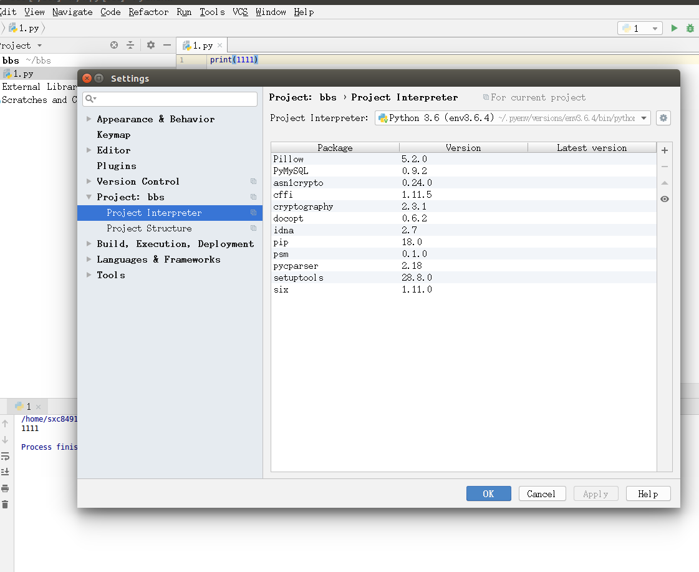
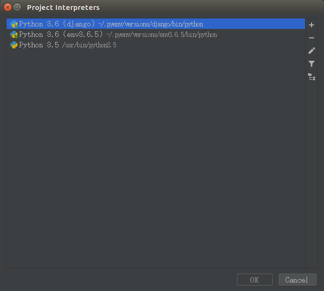
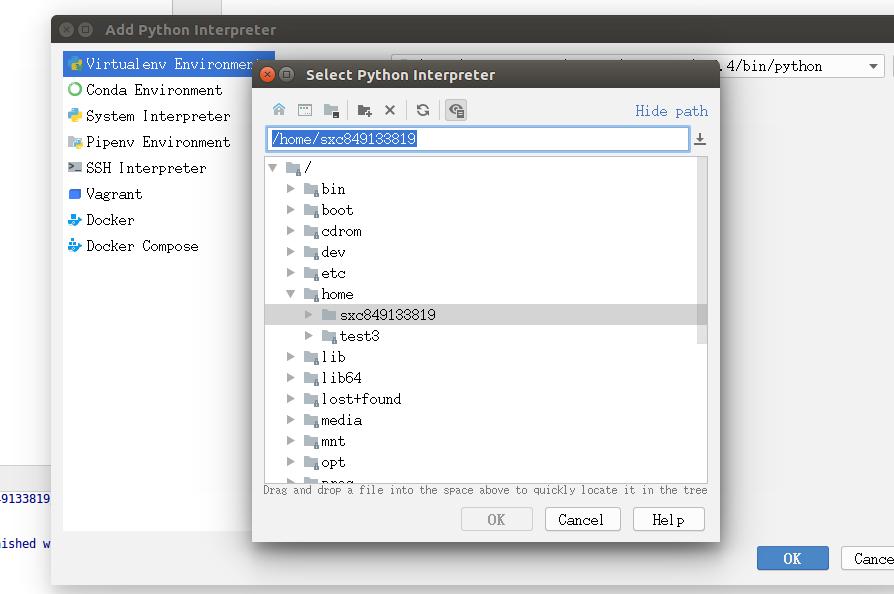
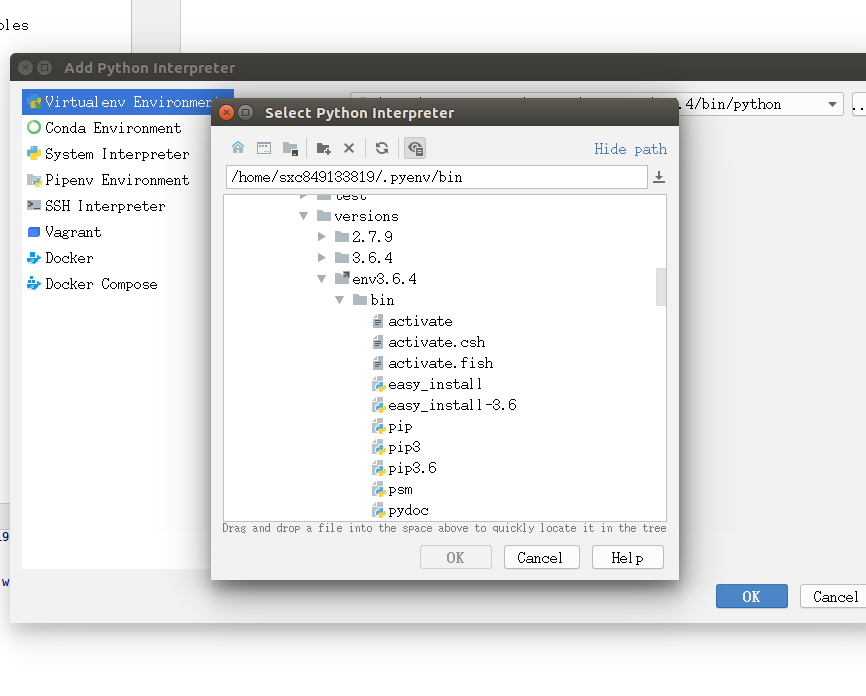
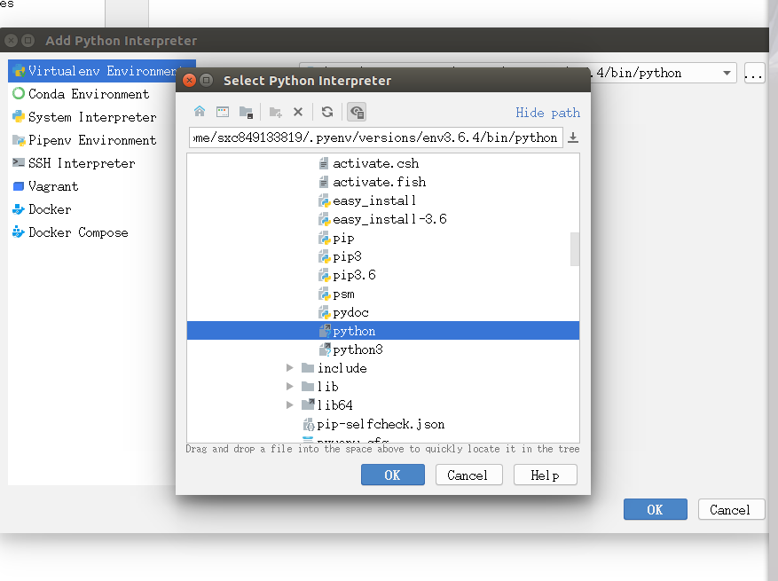

## 一、开机启动

可以设置开机启动有两个地方：第一，在/etc/init.d目录下，可以将服务放到这个目录下。第二是在/etc/init.d下的rc.local，可以将需要开机启动的程序写入这个文件。可以使用sysv-rc-conf命令进行设置和查看开机启动服务。

- 在/etc/init.d/下新建一个脚本test，格式如下：

  ~~~
  #!/bin/bash

  #要执行的命令
  exit 0
  ~~~

- 增加脚本可执行权限


  ~~~
sudo chmod +x test
  ~~~
- 设置开机启动

  ~~~
  sudo update-rc.d test defaults 
  #90是优先级，越大优先级越低，越晚执行
  ~~~
- 使用sysv-rc-conf命令设置运行级别

  ~~~
  #sysv-rc-conf默认没有安装，首先安装
  sudo apt-get install sysv-rc-conf

  #执行命令sysv-rc-conf，用空格键选中或取消指定的运行级别。

  #取消开机启动可以使用
  sudo update-rc.d -f 脚本名  remove
  ~~~


## 二、防火墙

UFW或Uncomplicated Firewall是iptables的接口，旨在简化配置防火墙的过程。UFW默认安装在Ubuntu上。如果没有安装，你可以使用sudo apt-get install ufw 。

- ufw常见操作

  ~~~
  sudo ufw status                 #查看状态和规则
  sudo ufw disable                #禁用
  sudo ufw enable                 #启用
  sudo ufw reset                  #重置
  sudo ufw status numbered        #显示规则编号
  ~~~

- 设置默认策略

  如果您刚刚开始使用防火墙，则首先要定义的规则是您的默认策略。这些规则控制如何处理未明确匹配任何其他规则的流量。

  ~~~
  sudo ufw default deny incoming   #拒绝所有传入连接
  sudo ufw default allow outgoing  #允许所有传出连接
  ~~~

- 开启或禁用指定连接

  ~~~
  #允许连接
  sudo ufw allow 端口/服务
  
  #允许ssh远程连接
  sudo ufw allow ssh  #或者sudo ufw allow 22/tcp  
  
  #允许未加密的web访问
  sudo ufw allow http  #或sudo ufw allow 80
  #允许加密的web访问
  sudo ufw allow https  #或sudo ufw allow 443
  
  #允许ftp访问
  sudo ufw allow ftp  #或sudo ufw allow 21/tcp
  
  #允许远程mysql访问
  sudo ufw allow 3306
  
  #允许特定范围的端口
  sudo ufw allow 6000:6007/tcp #允许使用端口6000 - 6007 X11连接
  
  #允许特定ip地址
  sudo ufw allow from 15.15.15.51
  
  #允许特定子网
  sudo ufw allow from 15.15.15.0/24  #允许所有的IP地址范围从15.15.15.1到15.15.15.254
  
  #拒绝连接
  sudo ufw deny http
  sudo ufw deny from 15.15.15.51
  ~~~

- 删除规则

  ~~~
  sudo ufw status numbered #先查看编号
  sudo ufw delete 2  #再按编号删除
  
  #按实际规则
  sudo ufw delete allow http
  sudo ufw delete allow 80
  ~~~


## 三、nginx环境搭建

## 四、下载

- wget  wget命令用来从指定的URL下载文件。wget非常稳定，它在带宽很窄的情况下和不稳定网络中有很强的适应性，如果是由于网络的原因下载失败，wget会不断的尝试，直到整个文件下载完毕。如果是服务器打断下载过程，它会再次联到服务器上从停止的地方继续下载。这对从那些限定了链接时间的服务器上下载大文件非常有用。

  ~~~
  #使用wget -c重新启动下载中断的文件，对于我们下载大文件时突然由于网络等原因中断非常有帮助，我们可以继续接着下载而不是重新下载一个文件。需要继续中断的下载时可以使用-c参数。
  sudo wget -c http://mirrors.sohu.com/python/3.6.4/Python-3.6.4.tar.xz
  
  #-P 将下载文件存到指定目录
  sudo wget -c http://mirrors.sohu.com/python/3.6.4/Python-3.6.4.tar.xz -P ~/  #下载保存到家目录
  ~~~

- curl

  curl命令是一个利用URL规则在命令行下工作的文件传输工具。它支持文件的上传和下载，所以是综合传输工具，但按传统，习惯称curl为下载工具。

  ~~~
  curl -O http://mirrors.sohu.com/python/3.6.4/Python-3.6.4.tar.xz
  ~~~


## 五、python开发环境配置

Python 2和Python 3之间存在着较大的差异，并且，由于各种原因导致了Python 2和Python 3的长期共存。在实际工作过程中，我们可能会同时用到Python 2和Python 3，因此，也需要经常在Python 2和Python 3之间进行来回切换。这就需要对python的版本进行管理，除此之外还需要对不同的软件包进行管理。大部分情况下，对于开源的库我们使用最新版本即可。但是，有时候可能需要对相同的Python版本，在不同的项目中使用不同版本的软件包。

在这里，我们要使用两个工具：pyenv和virtualenv。前者用于管理不同的Python版本，后者用于管理不同的工作环境。有了这两个工具，Python相关的版本问题将不再是问题。

### 5.1 pyenv

pyenv是一个Python版本管理工具，它能够进行全局的Python版本切换，也可以为单个项目提供对应的Python版本。使用pyenv以后，可以在服务器上安装多个不同的Python版本，也可以安装不同的Python实现。不同Python版本之间的切换也非常简单。pyenv官方地址https://github.com/pyenv/pyenv-installer

- 安装pyenv

~~~
#1 安装pyenv，在命令行下键入：
$ curl -L https://github.com/pyenv/pyenv-installer/raw/master/bin/pyenv-installer | bash

#默认安装到当前用户的工作目录下的.pyenv，我们可以查看一下
$ cd ~
$ ls -la

#如果安装过git，也可以使用以下安装方式安装
 $ git clone https://github.com/pyenv/pyenv.git ~/.pyenv

#2 将安装路径写入~/.bashrc
将以下三条语句写入 ~/.bashrc  
export PATH="/home/zhu/.pyenv/bin:$PATH"
eval "$(pyenv init -)"
eval "$(pyenv virtualenv-init -)"

$ source  ~/.bashrc  #配置立刻生效

$ echo $PATH
#如果路径第一个结尾是shims则表示成功
/home/python/.pyenv/plugins/pyenv-virtualenv/shims:/home/python/.pyenv/shims:/home/python/.pyenv/bin:/home/python/bin:/home/python/.local/bin:/usr/local/sbin:/usr/local/bin:/usr/sbin:/usr/bin:/sbin:/bin:/usr/games:/usr/local/games:/snap/bin


#也可以将上面三条命令写入到~/.barsh_profile，然后重启一下shell


#3 更新一下
$ pyenv update
~~~

- 使用pyenv

  ```
  #1.查看pyenv当前支持哪些Python版本
  python@ubuntu:~$ pyenv install --list
  Available versions:
    2.1.3
    2.2.3
    2.3.7
    ...
    
  #2.列出pyenv中所有可用的python版本
  python@ubuntu:~$ pyenv versions
    system
    3.5.4
  * 3.6.4 (set by /home/python/.pyenv/version)  # *表示当前使用的3.6.4版本
  
  #3.选择指定的python版本
  python@ubuntu:~$ pyenv global 3.5.4  #设置指定的版本
  python@ubuntu:~$ python  
  Python 3.5.4 (default, Mar 29 2018, 11:02:03)  #已经切换到了3.5.4
  [GCC 5.4.0 20160609] on linux
  Type "help", "copyright", "credits" or "license" for more information.
  >>> 
  切换Python版本以后，与版本相关的依赖也会一起切换。因此，我们不用担心不同的版本在系统中是否会相互干扰。
  
  #4. 删除指定python版本
  python@ubuntu:~$ pyenv uninstall 3.5.4
  pyenv: remove /home/python/.pyenv/versions/3.5.4? y
  python@ubuntu:~$ pyenv versions
    system
  * 3.6.4 (set by /home/python/.pyenv/version)
  ```

- 安装python

  ```shell
  #1.在安装python之前，我们必须要安装python所需要的依赖包，这个必须要安装，安装会失败的：
  $ sudo apt-get install libc6-dev gcc
  $ sudo apt-get install -y make build-essential libssl-dev zlib1g-dev libbz2-dev libreadline-dev libsqlite3-dev wget curl llvm

  #2. 安装python
  $ pyenv install 3.6.4 -v  #-v 以日志模式显示安装过程
  #因为pyenv会自动到github上下载，速度超慢，所以一般会选择使用curl或者wget下载到~/.pyenv/cache下，然后再用pyenv安装，下面是可选的安装模式
  $ cd ~/.pyenv
  $ sudo mkdir cache
  $ wget -c http://mirrors.sohu.com/python/3.6.4/Python-3.6.4.tar.xz -P  ~/.pyenv/cache/
  $ pyenv install 3.6.4 -v

  #3.更新pyenv数据库
   $ pyenv rehash

  #4.列出所安装的python版本
    $ pyenv versions

  #5.切换python版本
  $ pyenv  global 3.6.4

  #6.验证版本
   $ python
  ```

- 注意：

  - 使用pyenv管理python，必须是用pyenv安装的python才行，系统以前有的，需要重新用pyenv安装
  - 使用pip安装第三方模块时会安装到~/.pyenv/versions/xxx下，不会和系统模块发生冲突；
  - 使用pip安装模块后，可能需要执行pyenv rehash更新数据库。

### 5.2 virtualenv

virtualenv本身是一个独立的项目，用以隔离不同项目的工作环境。例如，项目A和项目B都是使用Python 2.7.13，但是，项目A需要使用Flask 0.8版本，项目B需要使用Flask 0.9版本。我们只要组合pyenv和virtualenv这两个工具，就能够构造Python和第三方库的任意版本组合，拥有了很好的灵活性，也避免了项目之间的相互干扰。

virtualenv本身是一个独立的工具，用户可以不使用pyenv单独使用virtualenv。但是，如果你使用了pyenv，就需要安装pyenv-virtualenv插件而不是virtualenv软件来使用virtualenv的功能。

项目主页：https://github.com/yyuu/pyenv-virtualenv

- 安装virtualenv（可选）

  如果是python3以上，安装完pyth就已经安装了virtualenv，就不用安装了

  ~~~
  #安装
  $ pip install virtualenv

  #或者，如果提示版本不匹配，可以使用--upgrade参数
  $ sudo pip install --upgrade virtualenv
  ~~~


- 使用virtualenv创建项目的虚拟环境

**一个项目创建一个virtualenv的虚拟环境**，在这个环境中，可以用pip安装项目所需的库，不会影响其他项目。切记一个项目一个虚拟环境，否则可能会发生莫名的错误。

~~~
#1.首先创建项目目录
$ sudo mkdir -p myproject/blog
cd myproject/blog

#2.创建项目的虚拟环境
#用法：pyenv virtualenv python版本号 虚拟环境名
$ pyenv virtualenv 3.6.4 env36   #注意版本号必须是已经安装的，否则会报错

#3.切换到虚拟环境
python@ubuntu:/myproject/blog$ pyenv activate env36

pyenv-virtualenv: prompt changing will be removed from future release. configure `export PYENV_VIRTUALENV_DISABLE_PROMPT=1' to simulate the behavior.

(env36) python@ubuntu:/myproject/blog$  # (env36)表示该项目处于虚拟环境中

#验证
(env36) python@ubuntu:/myproject/blog$ python
Python 3.6.4 (default, Mar 29 2018, 10:33:37) 
[GCC 5.4.0 20160609] on linux
Type "help", "copyright", "credits" or "license" for more information.

#4. 切出虚拟环境
(env36) python@ubuntu:/myproject/blog$ pyenv deactivate env36
~~~
- 使用pip下载库

使用pip下载，会从国外的网站下载，速度超慢，所以要切换pip到国内的镜像源，一般会用psm切换pip的源
- 1.安装一个软件psm

  ~~~
  (bbs36)python@ubuntu:/myproject/blog$ pip install psm
  [sudo] python 的密码： 
  正在读取软件包列表... 完成
  正在分析软件包的依赖关系树       
  正在读取状态信息... 完成       
  E: 无法定位软件包 psm
  ~~~

  ​

- 2.psm的使用
  以下操作需要在虚拟环境外进行，选择好镜像源后在进入虚拟环境

  ~~~
  #1.查看列出pip的镜像源
  (bbs36)python@ubuntu:/myproject/blog$ psm ls

  pypi 	 https://pypi.python.org/simple/
  douban 	 http://pypi.douban.com/simple/
  aliyun 	 http://mirrors.aliyun.com/pypi/simple/

  #查看当前的镜像源
  (bbs36)python@ubuntu:/myproject/blog$ psm show

  Current source is douban

  #2.选择指定的镜像源

  (bbs36)python@ubuntu:/myproject/blog$ psm use douban

  Source is changed to douban.

  #3 使用pip下载库
  (bbs36) python@ubuntu:/myproject/blog$ pip install pymysql
  ~~~

  ​


## 六、pycharm和虚拟开发环境结合

1.创建一个新的工程，file-setting->project  interpreter ，点击右边的...按钮-->show all





点击“+”，然后，在下图中选择Existing interperter后面的....


2. 打开virtual enviroment   选择已经存在的虚拟开发环境. 在你的家目录下-->.pyenv->versions --> 你的虚拟开发环境名称-->bin  选python

   

   

   

   

对已经存在的工程来说，file->settingd-> project xxx -->project interpreter  选择已经存在的虚拟开发环境