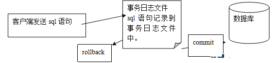
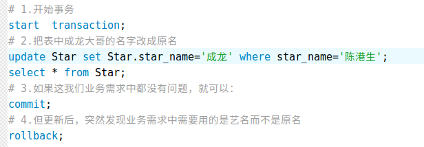

# Day03

### 一、上堂回顾

> 

### 二、用户和权限

#### 1.创建用户

```sql
基本语法： 
	Create user ‘用户名’@‘用户地址’ identified by ‘密码’;
示例： 
	Create user ‘test’@‘192.168.10.1’ identified by ‘12345’;
示例说明： 
	创建用户，并且设置密码
```

#### 2.删除用户

```
基本语法：
	drop user ‘用户名’@‘用户地址’;
示例：
	drop user ‘test’@‘192.168.10.1’;
示例说明：
	删除用户

```

#### 3.授予权限

```
基本语法：
	grant 权限 on *.* to ‘用户名’@‘用户地址’;
示例：
	grant 权限 on *.* to ‘test’@‘192.168.10.1’;
示例说明：
	给用户权限
```

#### 4.剥夺权限

```
基本语法：
	revoke 权限 on *.*  from ‘用户名’@‘用户地址’;
示例：
	revoke 权限 on *.* from ‘test’@‘192.168.10.1’;
示例说明：
	收回用户权限
```

### 三 索引

#### 1.索引介绍

```
索引看着挺高大上的一个名字，说白了就是我们一本书最前面的目录。

假如你用新华字典来查找“张”这个汉字，不使用目录的话，你可能要从新华字典的第一页找到最后一页，可能要花二个小时。字典越厚呢，你花的时间就越多。现在你使用目录来查找“张”这个汉字，张的首字母是z，z开头的汉字从900多页开始，有了这条线索，你查找一个汉字可能只要一分钟，由此可见索引的重要性。

索引用于快速找出在某个列中有一特定值的行。

不使用索引，MySQL必须从第1条记录开始然后读完整个表直到找出相关的行。表越大，花费的时间越多。如果表中查询的列有一个索引，MySQL能快速到达一个位置去搜寻到数据文件的中间，没有必要看所有数据。

当然索引也不易过多，索引越多写入，修改的速度越慢。因为，写入修改数据时，也要修改索引。

```

#### 2.索引分类

| 索引类型 | 功能说明                                     |
| :--- | ---------------------------------------- |
| 普通索引 | 最基本的索引，它没有任何限制                           |
| 唯一索引 | 某一行启用了唯一索引则不准许这一列的行数据中有重复的值。针对这一列的每一行数据都要求是唯一的 |
| 主键索引 | 它是一种特殊的唯一索引，不允许有空值。一般是在建表的时候同时创建主键索引，常用于用户ID。类似于书中的页码 |
| 全文索引 | 对于需要全局搜索的数据，进行全文索引                       |

#### 3.查看索引

```
基本语法：
	revoke 权限 on *.*  from ‘用户名’@‘用户地址’;
示例：
	revoke 权限 on *.* from ‘test’@‘192.168.10.1’;
示例说明：
	收回用户权限
```

#### 

```
基本语法：
	show index from tablename;
示例：
	show index from user\G;
示例说明：
	查看user表的索引结构
```

#### 4.普通索引


```
基本语法：
	alter table 表 add index(字段)
示例：
	alter table money add index(username);
示例说明：
	为money表的username字段增加索引
```

####  5.唯一索引

```
基本语法：
	alter table 表 add unique(字段)
示例：
	alter table money add unique(email);
示例说明：
	为money表的email字段增加唯一索引
```

####  6.主键索引

```
基本语法：
	alter table 表 add primary key(字段)
示例：
	alter table money add primary key(id);
示例说明：
	为money表的id字段增加主键索引
```

#### 7.创建表时声明索引

```
创建表时可在创建表语句后加上对应的类型即可声明索引：

primary key(字段) 
index (字段)
fulltext (字段)
unique (字段)

create table user (
	id int auto_increment,
	name varchar(20),
	primary key(id),
	unique (name),
) engine=innodb default charset=utf8;

```

#### 8.删除索引

```
基本语法：
	ALTER TABLE table_name DROP INDEX index_name
示例：
	alter table money drop index age;
示例说明：
	为money表删除age索引
```


### 四 事务

#### 1.事务控制语言(DTL)

```
我们每执行一条SQL语句,每执行一组SQL语句,我们都可以称为事务
如果一组SQL语句里,某一个SQL语句失败了,称为整个事务的失败,因此出现这种情况必须要恢复到正常的情况上才能没有问题.
在逛淘宝的时候，购买了某一个货品钱付了,但淘宝服务器刚好断电了,商家没办法收到你的钱,就不发货。 担保交易
银行中转帐的时候, 款已经扣除了,但突然断电,导致对方收不到钱.

如果有了事务，就可以避免该事情。
事务可以看作是一个“容器”，将多条语句，放入该容器，最后，只要一个命令行，来决定其中的所有语句是否“执行” 

```

#### 2.事务的四大特征

```
	在 MySQL 中只有使用了 Innodb 数据库引擎的数据库或表才支持事务。
	事务处理可以用来维护数据库的完整性，保证成批的 SQL 语句要么全部执行，要么全部不执行。
	事务用来管理 insert,update,delete 语句

一般来说，事务是必须满足4个条件（ACID）：
		原子性（Atomicity，或称不可分割性）、
		一致性（Consistency）、
		隔离性（Isolation，又称独立性）、
		持久性（Durability）。

原子性：
	一个事务（transaction）中的所有操作，要么全部完成，要么全部不完成，不会结束在中间某个环节。事务在执行过程中发生错误，会被回滚（Rollback）到事务开始前的状态，就像这个事务从来没有执行过一样。

一致性：
	在事务开始之前和事务结束以后，数据库的完整性没有被破坏。这表示写入的资料必须完全符合所有的预设规则，这包含资料的精确度、串联性以及后续数据库可以自发性地完成预定的工作。

隔离性：
	数据库允许多个并发事务同时对其数据进行读写和修改的能力，隔离性可以防止多个事务并发执行时由于交叉执行而导致数据的不一致。事务隔离分为不同级别，包括读未提交（Read uncommitted）、读提交（read committed）、可重复读（repeatable read）和串行化（Serializable）。

持久性：
	事务处理结束后，对数据的修改就是永久的，即便系统故障也不会丢失。

```


#### 3.事务的原理

##### 传统的情况：


##### 事务的机制:




#### 4.事务模式

```
在mysql中默认一条sql语句一个事务
因此,如果需要开启事务模式的话,我们需要执行
输入 set  autocommit = 0; 开启非单条语句一个事务模式.

或者使用 start transaction开头,开启事务模式
这样会使得 必须要commit 语句执行后,才能真正生效

```

#### 5.事务的流程

| 执行语句                    | 说明                                       |
| ----------------------- | ---------------------------------------- |
| start transaction       | 执行开始事务命令后,下面将进入事务模式.                     |
| update、delete、insert 操作 | 在事务执行后,这些操作只在内存状态下进行,而不是在物理状态下           |
| commit                  | 在事务执行完成后,确认执行无误且成功,就可以使用commit把内存中执行的结果,提交到物理内存中 |
| rollback                | 如果在事务执行过程中,发生了错误,则可以使用rollback命令回滚到上一个事务操作 |

#### 6.事务的使用




### 五 Python操作MySQL

#### 1.连接MySQL

```python
import pymysql

# 连接mysql
# 参数1：表示主机或ip地址
# 参数2：表示mysql的用户名
# 参数3：表示mysql的密码
# 参数4：表示mysql的数据库名
# conn = pymysql.connect('localhost', 'root', 'root', 'mydb2')
conn = pymysql.connect('10.36.132.6', 'root', 'root', 'mydb2')
# 创建游标对象: 可以执行sql语句
cursor = conn.cursor()

# sql语句
sql = 'select version()'

# 执行sql语句
cursor.execute(sql)

res = cursor.fetchone()
print(res)

# 关闭游标对象
cursor.close()
# 关闭mysql的连接
conn.close()

```

#### 2.插入数据

```python
import pymysql

conn = pymysql.connect('localhost', 'root', 'root', 'mydb2')
cursor = conn.cursor()

# 插入数据
sql = 'insert into person(name, age) values("aa", 20)'

try:
    cursor.execute(sql)
    # 提交事务
    conn.commit()
except:
    # 回滚
    conn.rollback()

cursor.close()
conn.close()

```

#### 3. 删除数据

```python
import pymysql

conn = pymysql.connect('localhost', 'root', 'root', 'mydb2')
cursor = conn.cursor()

# 删除数据
sql = 'delete from person where id=18'

try:
    cursor.execute(sql)
    # 提交事务
    conn.commit()
except:
    # 回滚
    conn.rollback()

cursor.close()
conn.close()

```

#### 4. 更新数据

```python
import pymysql

conn = pymysql.connect('localhost', 'root', 'root', 'mydb2')
cursor = conn.cursor()

# 更新数据
sql = 'update person set age=30 where id=20'

try:
    cursor.execute(sql)
    # 提交事务
    conn.commit()
except:
    # 回滚
    conn.rollback()

cursor.close()
conn.close()

```

#### 5.查询数据

```python
import pymysql

conn = pymysql.connect('localhost', 'root', 'root', 'mydb2', charset='utf8')
cursor = conn.cursor()

# 查询数据
sql = 'select * from person'
# 执行sql
cursor.execute(sql)

# fetchone() : 每次查询下一条数据
# res = cursor.fetchone()
# print(res)
# res = cursor.fetchone()
# print(res)
# res = cursor.fetchone()
# print(res)

# fetchall() : 所有数据
res = cursor.fetchall()
# res = cursor.fetchmany(3)  # 前3条数据
for row in res:
    print(row)

print(cursor.rowcount)  # 总的数据条数

cursor.close()
conn.close()
```

 


